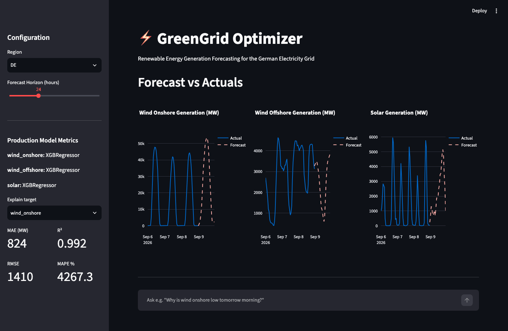
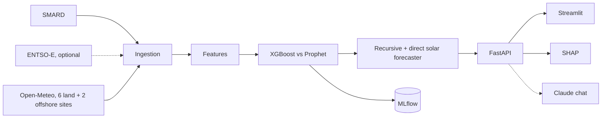

# GreenGrid Optimizer

Hourly forecasts of German wind (onshore, offshore) and solar generation, 1 to 72 hours ahead, with SHAP explanations, a FastAPI service, a Streamlit dashboard and an optional LLM chat.

[](https://github.com/nithya-prakash/GreenGridOptimizer/actions/workflows/ci.yml)  



*Local instance, recorded 2026-10-09. The yellow banner is the staleness warning: the local data ends 2026-09-26 and was not refreshed for the recording.*

## Results

Walk-forward backtest (`src/evaluation/backtest.py`, `models/backtest_results.json`): 120 days (2026-05-29 to 2026-09-26), 4 expanding-window folds with 1-week test windows, models and XGBoost hyperparameters re-trained per fold. Forecasts start every 7h and run 72h ahead (86 runs). Weather is lead-matched: a step L hours ahead uses the forecast issued about L//24 days earlier (Open-Meteo Previous Runs API).

MAE in MW by lead time: model ± std across folds / persistence / seasonal naive (same hour, last observed day). Bold is best.

| Lead time | wind_onshore (mean 10.6 GW) | wind_offshore (mean 2.5 GW) | solar (mean 14.9 GW) |
|---|---|---|---|
| 1h | 1342 ±537 / **1192** / 7951 | **316** ±39 / 328 / 1366 | **1056** ±265 / 3009 / 2651 |
| 2–6h | **2959** ±539 / 3526 / 7792 | **592** ±128 / 773 / 1411 | **1326** ±197 / 12031 / 2695 |
| 7–24h | **3966** ±970 / 6779 / 8045 | **794** ±67 / 1356 / 1437 | **1359** ±222 / 17101 / 2680 |
| 25–48h | **3783** ±559 / 9881 / 10855 | **857** ±69 / 1417 / 1483 | **1568** ±56 / 15555 / 3100 |
| 49–72h | **4093** ±593 / 10634 / 10694 | **863** ±113 / 1490 / 1547 | **1618** ±201 / 15637 / 2980 |

- From 2h ahead the model beats both baselines on all three sources (1.7-2.6x better than the stronger baseline at 25-72h).
- **At 1h, onshore wind loses to persistence** (1342 vs 1192 MW) and offshore only ties it (316 vs 328).
- Single holdout week, 1h ahead (MLflow, MAE MW, onshore / offshore / solar): XGBoost 1021 / 314 / 1137 vs Prophet with regressors 3209 / 1241 / 2252. XGBoost is served. Not comparable with the table above.

| Check | Result |
|---|---|
| Tests | 73 pass, `ruff check .` clean |
| Load test (20 users, 60 s, local, M4) | 1217 requests, **0 errors**, 20.6 req/s, median 8 ms, p95 140 ms, p99 390 ms; first uncached `/forecast` up to 3.9 s |
| Kubernetes manifests | `kubeconform` valid (6 resources); **never applied to a cluster** |
| Live ENTSO-E, live Claude chat | **not tested** (no keys) |

## Quickstart

```bash
docker compose up --build        # API :8000, dashboard :8501, updater; all on 127.0.0.1
```

No `.env` needed. On first start the updater ingests 120 days and trains the models, then refreshes data every 6h and retrains weekly (a failed refresh keeps the last good state). MLflow UI is opt-in: `docker compose --profile dev-tools up mlflow`.

| Optional variable | Purpose |
|---|---|
| `ENTSOE_API_KEY` | ENTSO-E data; without it SMARD is used |
| `ANTHROPIC_API_KEY`, `API_AUTH_TOKEN` | enable `/chat`; the token (`X-API-Key`) is required whenever the key is set |
| `CORS_ORIGINS` | allowed origins, default `http://localhost:8501` |

No hosted deployment. A Hugging Face Space packaging (`GreenGridOptimizer-space`) was deferred and is not deployed. Kubernetes: [k8s/](k8s/README.md).

## How it works



- **Data**: SMARD generation (verified path; ENTSO-E is tried first when keyed). Models train on archived *forecast* weather, so training sees the same imperfect inputs as serving. Ingestion checks physics (solar about 0 at night).
- **Wind**: recursive; each step predicts t+1 and feeds it back (`src/models/recursive.py`, the function the backtest evaluates).
- **Solar**: 1h model for the first step, then a direct multi-horizon model (`src/models/solar_direct.py`). Recursive solar lost to seasonal naive beyond about 6h.
- **MLflow**: `src/models/trainer.py` logs one run per model and source (experiment `GreenGrid_Forecasting`, `mlruns/mlflow.db`): MAE, MAPE, R2, RMSE plus `model_type`, `use_regressors` and XGBoost hyperparameters. No model artifacts are logged; the served model is a pickle in `models/production/`.
- **Chat**: answers questions grounded in the forecast, actuals and SHAP data on screen.

Stack: FastAPI, Streamlit, XGBoost, Prophet, SHAP, MLflow, Docker Compose.

## Usage

```bash
curl "localhost:8000/forecast?hours_ahead=48"
curl "localhost:8000/forecast/explain?target=solar"
curl localhost:8000/historical?limit=168    # also: /backtest /metrics /model/info /data/status
curl -X POST localhost:8000/chat -H "X-API-Key: $API_AUTH_TOKEN" -H 'content-type: application/json' -d '{"message": "Why is solar low tomorrow?"}'
python -m src.jobs.refresh --once           # ingest, features, train, as the updater does
python -m src.evaluation.backtest           # optional, about 5 min
```

API docs at http://localhost:8000/docs. **Power BI / Tableau**: `python -m scripts.export_bi` writes five star-schema CSVs to `bi/` (about 260 KB); schema, relationships and measures in [docs/powerbi.md](docs/powerbi.md). No `.pbix` included.

## Evaluation method

- **Two data bugs the evaluation surfaced, both fixed.** (1) Until 2026-09-26 the SMARD client used wrong filter IDs: "onshore" was photovoltaics, "offshore" hard coal, "solar" pumped storage. (2) Open-Meteo labels radiation by the end of the hour, SMARD by the start, so the join was one hour off; fixing it raised 1h solar MAE from about 840 to 1060 MW and improved every other lead.
- **Load test** (`loadtest/locustfile.py`): mixed read traffic, 20 users, 60 s, one uvicorn process on an M4, `API_AUTH_TOKEN` set so the rate limiter is not measured. Median / p95 ms: `/forecast` 7 / 120, `/forecast/explain` 72 / 200, `/historical` 14 / 82. `/forecast` p99 (2.5 s) is the first uncached computation, which calls Open-Meteo. Not a capacity number.
- The first run found a real bug: concurrent requests saw a half-filled model dict and `/forecast` returned 500. Fixed in `src/api/routes.py` with a regression test; the numbers above are after the fix.

```bash
pip install locust && API_AUTH_TOKEN=... locust -f loadtest/locustfile.py --host http://localhost:8000 --headless -u 20 -r 5 -t 60s
```

## Feature status

| Feature | Status |
|---|---|
| SMARD + Open-Meteo ingestion, recursive wind and direct solar forecasting, SHAP, updater service | implemented, tested, backtested |
| MLflow tracking | implemented (metrics and parameters only) |
| BI export | implemented, tested; no `.pbix` |
| Kubernetes manifests | validated with `kubeconform` only; **not applied to a cluster** |
| ENTSO-E client | parsing tested on a fixture; **never run with a live key** |
| Claude chat | auth, limits and request handling tested; **never run against the live API** |
| Hosted deployment | **none** |

## Limitations

- About 4 months of data and 4 folds: wide error bars, no full seasonal cycle.
- At 1h, onshore wind does not beat persistence. A persistence blend is untried, as is a direct wind model.
- Lead-matched weather is matched to the day, not the exact model run; weather sites are hand-weighted, not capacity-weighted.
- Prophet metrics in MLflow are single-holdout and not comparable with the walk-forward table.
- Read endpoints are public by design (rate limited per IP). Use a TLS proxy before exposing the stack, and keep MLflow private (unauthenticated).

## Repository layout

```
src/  ingestion, features, models, evaluation, explainability, api, jobs   frontend/  Streamlit
configs/  pipeline.yaml    models/  backtest results   bi/  CSV export   docs/  powerbi.md, GIF
k8s/  manifests            loadtest/  Locust           locks/  hash-pinned lockfiles   tests/  scripts/
```

## Checks

```bash
docker build --build-arg INSTALL_DEV=true -t greengrid:dev . && docker run --rm greengrid:dev python -m pytest tests/
ruff check .
kubectl kustomize k8s | kubeconform -strict -summary -kubernetes-version 1.30.0
```

CI runs lint, the Docker build and tests, a check that no `.env`/data/`.git` is in the image, `kubeconform`, and a `docker compose up` smoke test on a clean checkout. Lockfiles: regenerate with `scripts/lock.sh`.

## Roadmap

Persistence blend for the first hours, a direct wind model, more seasons of data, a live ENTSO-E test. Context: German grid operators spent EUR 2.77 billion on congestion management in 2024 ([Clean Energy Wire](https://www.cleanenergywire.org/news/germanys-needs-and-costs-grid-management-down-2024-network-agency)).

## License

MIT, see [LICENSE](LICENSE).
