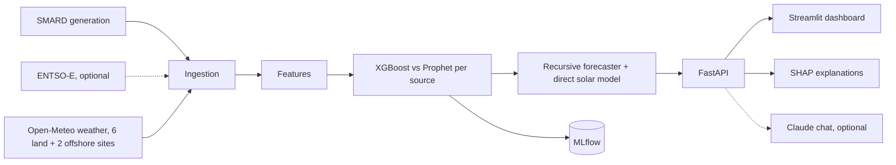

# GreenGrid Optimizer

Hourly forecasts of German wind (onshore, offshore) and solar generation, 1 to 72 hours ahead, with SHAP explanations, a FastAPI service, a Streamlit dashboard and an optional LLM chat about the forecast.

[](https://github.com/nithya-prakash/GreenGridOptimizer/actions/workflows/ci.yml) 


*Local instance. Changing the horizon in the dashboard recomputes the forecast for all three sources.*

## Results

Walk-forward backtest (`src/evaluation/backtest.py`, output in `models/backtest_results.json`): 120 days of data (2026-05-29 to 2026-09-26), 4 expanding-window folds with a 1-week test window each. Models and XGBoost hyperparameters are re-trained on each fold's training data only. Inside each test week the served forecast starts from an origin every 7h and runs 72h ahead (86 runs). Weather is lead-matched: a step L hours ahead uses the weather forecast issued about L//24 days earlier (Open-Meteo Previous Runs API), as it would be live.

Forecast MAE in MW by lead time: model ± std across folds / persistence / seasonal naive (same hour, last observed day). Bold is the best of the three.

| Lead time | wind_onshore (mean 10.6 GW) | wind_offshore (mean 2.5 GW) | solar (mean 14.9 GW) |
|---|---|---|---|
| 1h | 1342 ±537 / **1192** / 7951 | **316** ±39 / 328 / 1366 | **1056** ±265 / 3009 / 2651 |
| 2–6h | **2959** ±539 / 3526 / 7792 | **592** ±128 / 773 / 1411 | **1326** ±197 / 12031 / 2695 |
| 7–24h | **3966** ±970 / 6779 / 8045 | **794** ±67 / 1356 / 1437 | **1359** ±222 / 17101 / 2680 |
| 25–48h | **3783** ±559 / 9881 / 10855 | **857** ±69 / 1417 / 1483 | **1568** ±56 / 15555 / 3100 |
| 49–72h | **4093** ±593 / 10634 / 10694 | **863** ±113 / 1490 / 1547 | **1618** ±201 / 15637 / 2980 |

- From 2h ahead, the model beats both baselines for all three sources at every lead time (1.7-2.6x better than the stronger baseline at 25-72h).
- **At 1h, onshore wind loses to persistence** (1342 vs 1192 MW) and offshore only ties it (316 vs 328 MW). The value of the model is in the 2-72h range.
- Model comparison on a single holdout week (MLflow runs, MAE in MW, 1h-ahead): XGBoost 1021 / 314 / 1137 vs Prophet with weather regressors 3209 / 1241 / 2252 (onshore / offshore / solar). XGBoost is what is served. These are single-holdout numbers, not the walk-forward ones above.
- Only about 4 months of data and 4 folds, so the error bars are wide.

| Check | Result |
|---|---|
| Tests | 73 pass (`pytest tests`), `ruff check .` clean |
| Load test, 20 users, 60 s, local, no rate limiting | 1217 requests, **0 errors**, 20.6 req/s, median 8 ms, p95 140 ms, p99 390 ms; first uncached `/forecast` took up to 3.9 s |
| Kubernetes manifests | render and schema-validate with `kubeconform` (6 resources valid); **never applied to a cluster** |
| Live ENTSO-E | **not tested** (no key) |
| Live Claude chat | **not run** (no key) |

Load-test details are in [Evaluation method](#evaluation-method).

## Quickstart

```bash
docker compose up --build        # API :8000, dashboard :8501, updater; all on 127.0.0.1
open http://localhost:8501
```

No `.env` is needed. On first start the updater ingests 120 days, builds features and trains the models, then refreshes data every 6h and retrains weekly. A failed refresh keeps the last good data and models. MLflow UI is opt-in: `docker compose --profile dev-tools up mlflow` (`127.0.0.1:5000`).

| Variable (optional, `.env.example`) | Purpose |
|---|---|
| `ENTSOE_API_KEY` | enables ENTSO-E data; without it SMARD is used |
| `ANTHROPIC_API_KEY` | enables `/chat`; without it `/chat` returns 503 |
| `API_AUTH_TOKEN` | shared secret (`X-API-Key`) required for `/chat`; chat stays disabled without it when a key is set |
| `CORS_ORIGINS` | allowed browser origins, default `http://localhost:8501` |

There is no hosted deployment. A Hugging Face Space packaging exists in a separate folder (`GreenGridOptimizer-space`) but was deferred and is not deployed. Kubernetes manifests are in [k8s/](k8s/README.md).

## How it works



- **Data**: hourly generation from SMARD (Bundesnetzagentur, the verified path); ENTSO-E is attempted first when a key is set and falls back to SMARD. Weather comes from Open-Meteo: 6 land sites (north for onshore wind, south for solar) plus North Sea / Baltic points for offshore wind (`configs/pipeline.yaml`). Models train on archived *forecast* weather, not observations, so training sees the same imperfect inputs as serving. Ingestion also checks physics (solar must be about 0 at night).
- **Wind**: recursive. Each step predicts t+1 from current generation, lags, rolling stats and forecast weather for t+1, then feeds the prediction back in (`src/models/recursive.py`, the same function the backtest evaluates).
- **Solar**: the 1h model for the first step, then a direct multi-horizon model (`src/models/solar_direct.py`) for leads of 2h and more. Recursive solar compounded its errors and lost to seasonal naive beyond about 6h.
- **Explainability**: SHAP contributions for any target's latest prediction (`/forecast/explain`, dashboard).
- **MLflow**: `src/models/trainer.py` logs one run per model and source (experiment `GreenGrid_Forecasting`, SQLite store `mlruns/mlflow.db`): `MAE`, `MAPE`, `R2`, `RMSE` plus parameters (`model_type`, `use_regressors`, XGBoost `n_estimators`, `max_depth`, `learning_rate`, `subsample`, `colsample_bytree`). It logs no model artifacts; the served model is a pickle in `models/production/`. The store holds 45 finished runs from earlier retrains.
- **Chat**: answers questions about the current forecast, grounded in the forecast, actuals and SHAP data the dashboard shows. Optional.

Stack: FastAPI, Streamlit, XGBoost, Prophet, SHAP, MLflow, pandas, Docker Compose.

## Usage

```bash
curl "localhost:8000/forecast?hours_ahead=48"        # wind_onshore_mw, wind_offshore_mw, solar_mw per hour
curl "localhost:8000/forecast/explain?target=solar"  # SHAP contributions
curl localhost:8000/historical?limit=168
curl localhost:8000/backtest                         # walk-forward results
curl localhost:8000/metrics                          # latest holdout metrics
curl localhost:8000/model/info
curl localhost:8000/data/status                      # age of the latest data point
curl -X POST localhost:8000/chat -H "X-API-Key: $API_AUTH_TOKEN" -H 'content-type: application/json' -d '{"message": "Why is solar low tomorrow?"}'
```

Interactive docs at http://localhost:8000/docs. Run the pipeline by hand (inside the `api` container, or locally with `PYTHONPATH=.`):

```bash
python -m src.jobs.refresh --once             # everything below, as the updater does it
python -m src.ingestion.pipeline --days 120
python -m src.features.feature_engineering
python -m src.models.trainer                  # Prophet vs XGBoost per source; logs to MLflow
python -m src.evaluation.backtest             # optional, about 5 min
python -m src.explainability.shap_analysis    # optional
```

**Power BI / Tableau**: `python -m scripts.export_bi` writes five star-schema CSVs to `bi/` (about 260 KB, committed). Schema, relationships and example measures are in [docs/powerbi.md](docs/powerbi.md). The `.pbix` itself is not included.

## Evaluation method

- **Backtest** as described under Results; baselines are persistence (last value) and seasonal naive. Reproduce with `python -m src.evaluation.backtest`.
- **Two data bugs the evaluation surfaced, both fixed.** (1) Until 2026-09-26 the SMARD client used wrong filter IDs, so "wind onshore" was actually photovoltaics, "offshore" hard coal and "solar" pumped storage; every earlier number was for the wrong sources. (2) Open-Meteo labels radiation by the *end* of the hour, SMARD by the *start*; the join was one hour out of step. Fixing it helped solar at all leads except 1h (1h MAE rose from about 840 to about 1060 MW).
- **Load test** (`loadtest/locustfile.py`, Locust, mixed read traffic weighted towards `/forecast`): 20 users, ramp 5/s, 60 s, uvicorn on a MacBook (Apple M4), with `API_AUTH_TOKEN` set so the rate limiter is not what is measured. Result: 1217 requests, 0 failures. Per endpoint, median / p95 in ms: `/forecast` 7 / 120, `/forecast/explain` 72 / 200, `/historical` 14 / 82, `/backtest` 4 / 57, `/model/info` 5 / 39. `/forecast` is cached, so its p99 (2.5 s) is the first uncached computation, which includes an Open-Meteo call. Not a production-capacity number: one process, one machine, read-only traffic.
- The first load-test run found a real bug: concurrent requests could see a half-filled model dictionary and `/forecast` returned 500 (`KeyError: 'solar'`). Fixed in `src/api/routes.py` with a regression test; the rerun above is after the fix.

```bash
pip install locust
API_AUTH_TOKEN=... locust -f loadtest/locustfile.py --host http://localhost:8000 --headless -u 20 -r 5 -t 60s
```

## Feature status

| Feature | Status |
|---|---|
| SMARD ingestion, Open-Meteo multi-site weather | implemented, used for all results |
| Recursive wind forecaster, direct solar model | implemented, backtested |
| Prophet vs XGBoost comparison, MLflow tracking | implemented (metrics and parameters only) |
| SHAP explanations | implemented, in the API and dashboard |
| Updater service (refresh 6h, retrain weekly, atomic writes, hot-reload) | implemented, tested |
| Hash-pinned per-architecture lockfiles (`locks/`) | implemented |
| BI export | implemented, tested; no `.pbix` |
| Kubernetes manifests | validated with `kubeconform` only; **not applied to a cluster** |
| Locust load test | run locally, results above |
| ENTSO-E client | parsing tested against a fixture; **never run with a live key** |
| Claude chat | request handling, auth and limits tested; **never run against the live Anthropic API** |
| Hosted deployment | **none** |

## Limitations

- Only about 4 months of data and 4 folds; the error bars are wide and no seasonal cycle is covered.
- At 1h, onshore wind does not beat persistence and offshore only ties it. A persistence blend for the first hours is untried.
- Lead-matched weather is matched to the day (run issued about L//24 days earlier), not to the exact model run and lead hour.
- Wind is recursive; a direct multi-horizon wind model like the solar one is untried.
- Weather is a hand-weighted average over a few sites, not capacity-weighted per grid cell.
- ENTSO-E and the live chat are unverified (no keys). Kubernetes was never applied to a cluster. No hosted deployment.
- Prophet metrics in MLflow come from a single holdout week and should not be compared with the walk-forward table.
- The read endpoints are public by design for a demo (rate limited per IP). Put the stack behind a TLS proxy before exposing it, and keep MLflow private (unauthenticated).

## Repository layout

```
src/        ingestion, preprocessing, features, models, evaluation, explainability, api, jobs
frontend/   Streamlit dashboard            configs/   pipeline.yaml (non-secret parameters)
models/     backtest_results.json and plots (production/*.pkl is git-ignored)
bi/         Power BI CSV export            docs/      powerbi.md, dashboard.gif
k8s/        manifests (kustomize)          loadtest/  Locust file
locks/      hash-pinned lockfiles          notebooks/ EDA and model comparison
tests/      pytest suite                   scripts/   export_bi.py, lock.sh
```

## Checks

```bash
docker build --build-arg INSTALL_DEV=true -t greengrid:dev . && docker run --rm greengrid:dev python -m pytest tests/
ruff check .
kubectl kustomize k8s | kubeconform -strict -summary -kubernetes-version 1.30.0
```

CI runs ruff, the Docker build and tests, a check that no `.env`/data/`.git` is baked into the image, `kubeconform` on the manifests, and a `docker compose up` smoke test on a clean checkout. Dependencies: `requirements*.txt` list top-level packages; the image installs from hash-pinned lockfiles (regenerate with `scripts/lock.sh`).

## Roadmap

Next: persistence blend for the first hours, a direct wind model, more data to cover more seasons, a live ENTSO-E test. Why it matters: German grid operators spent EUR 2.77 billion on congestion management in 2024 ([Bundesnetzagentur data via Clean Energy Wire](https://www.cleanenergywire.org/news/germanys-needs-and-costs-grid-management-down-2024-network-agency)); better short-horizon forecasts reduce how conservatively they must plan.

## License

MIT, see [LICENSE](LICENSE).
