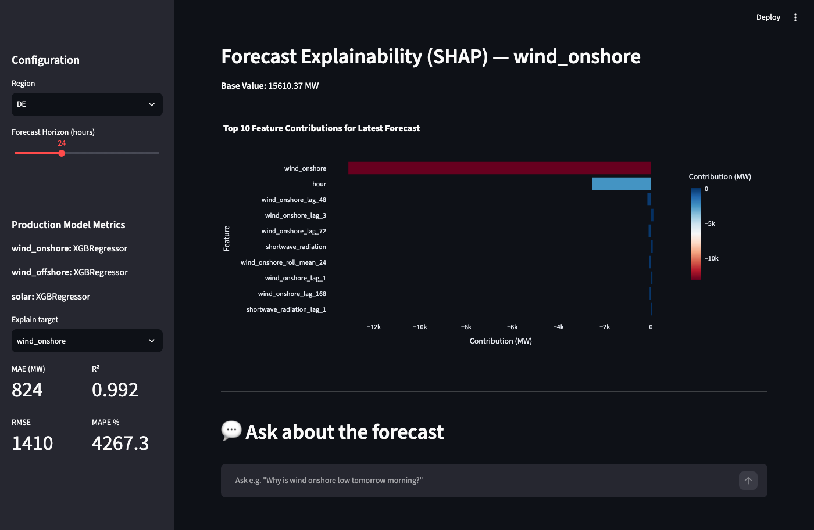

# GreenGrid Optimizer

[](https://github.com/nithya-prakash/GreenGridOptimizer/actions/workflows/ci.yml)

An end-to-end ML application that forecasts renewable energy generation (wind onshore, wind offshore, and solar) for Germany. It ingests real public data, trains and compares multiple forecasting approaches per source, explains its predictions with SHAP, serves real recursive multi-step forecasts through a FastAPI backend, and lets you ask questions about the forecast in plain language via an LLM chat feature — all containerized and deployable with `docker-compose up`.



## Problem Statement

Accurate short-horizon (24–72h) forecasts of renewable output are essential for grid balancing. For operators like TenneT, 50Hertz, Amprion, and TransnetBW in Germany, poor forecasts increase redispatch costs, reliance on fossil backup capacity, grid instability, and renewable curtailment. GreenGrid Optimizer addresses this by simulating a grid operator's forecasting system.

## Architecture

Data Source (SMARD generation + Open-Meteo weather) → Ingestion Pipeline → Feature Engineering → Model Training (Prophet vs. XGBoost, per source) → FastAPI Backend (recursive multi-step forecast, SHAP explainability, LLM chat) → Streamlit Dashboard

## What it actually does

- **Forecasting**: real recursive multi-step forecasts (1–72h ahead) for wind onshore, wind offshore, and solar — each hour's prediction is fed back in as input for the next, using live Open-Meteo weather forecasts (not historical data replayed as if it were a forecast).
- **Modeling**: Prophet (base + weather regressors) and XGBoost trained and compared per target; XGBoost wins on every target so far and is what's served.
- **Explainability**: SHAP feature contributions for any target's latest prediction, browsable from the dashboard.
- **Chat**: ask questions about the current forecast in plain language ("why is wind onshore low tomorrow morning?") — answered by Claude grounded in the forecast/actuals/SHAP data the dashboard is already showing. Optional — the rest of the app works without an API key.
- **Validation**: walk-forward (rolling-origin) backtesting over 4 time-separated weekly folds per target, not a single lucky/unlucky holdout week — see Model Performance below.

## Model Performance

Walk-forward backtest, 4 weekly folds per target, expanding training window (`src/evaluation/backtest.py`, full results in `models/backtest_results.json`, plots in `models/backtest_*.png`):

| Target | MAE (mean ± std) | R² (mean ± std) |
|---|---|---|
| wind_onshore | 1131 ± 342 MW | 0.985 ± 0.007 |
| wind_offshore | 260 ± 56 MW | 0.940 ± 0.023 |
| solar | 419 ± 37 MW | 0.858 ± 0.030 |

Two things this surfaced that a single holdout split would have hidden: wind_onshore's error drops sharply as training data grows fold-to-fold (more history clearly helps), and solar's R² degrades over the most recent folds (0.907 → 0.826) — consistent with seasonal drift as daylight hours shrink into autumn, and a real argument for periodic retraining rather than a train-once model.

## Folder Structure

- `configs/`: Non-secret pipeline parameters (holdout/backtest window sizes, forecast horizon, chat model) — see `configs/pipeline.yaml`. Secrets and deployment-specific values (API keys, region coordinates) stay in `.env`.
- `data/`: Raw, processed, and external datasets (git-ignored)
- `models/`: Trained model artifacts (`production/*.pkl` git-ignored; diagnostic/backtest plots and `backtest_results.json` are tracked)
- `mlruns/`: MLflow tracking data (git-ignored)
- `notebooks/`: Jupyter notebooks for EDA and model comparison
- `src/`: Source code modules (ingestion, preprocessing, features, models, evaluation, explainability, api, utils)
- `frontend/`: Streamlit dashboard
- `tests/`: Pytest suite — 25 tests across feature engineering, data validation, the forecast endpoint (including a missing-model-file and a malformed-dtype regression test), the chat endpoint, backtest fold logic, config loading, and the ENTSO-E XML parser
- `.github/workflows/`: CI — builds the Docker image and runs the test suite on push/PR to main

## Installation and Docker Instructions

Ensure you have Docker and docker-compose installed.

1. Clone the repository.
2. Copy `.env.example` to `.env`. Everything below is optional:
   - `ENTSOE_API_KEY` — enables real ENTSO-E data (see Limitations: implemented but unverified against a live key). Without it, ingestion falls back to SMARD automatically, no key needed.
   - `ANTHROPIC_API_KEY` — enables the dashboard's chat feature. Without it, `/chat` returns a clear 503 and the rest of the app is unaffected.
3. Run `docker-compose up --build` to start the API (`:8000`), the Streamlit dashboard (`:8501`), and the MLflow UI (`:5000`).
4. The API/dashboard need trained models to serve forecasts from. Run the pipeline once first (inside the `api` container or locally with `PYTHONPATH=.`):
   ```
   python -m src.ingestion.pipeline   # or write a small script calling run_ingestion_pipeline(start_date, end_date)
   python -m src.features.feature_engineering
   python -m src.models.trainer
   ```

## Limitations and Next Steps

- The ENTSO-E client (`src/ingestion/entsoe_client.py`) implements the real Transparency Platform API (Actual Generation per Type, XML parsing) per ENTSO-E's public documentation, but no API key was available to test the live call — only the parsing logic is verified (`tests/test_entsoe_client.py`, against a schema-accurate fixture). SMARD remains the verified, real data path; ENTSO-E is attempted first and falls back to SMARD on any failure.
- No cloud deployment — runs locally via `docker-compose` only.
- Solar's backtested accuracy degrades over more recent folds (see Model Performance) — worth periodic retraining rather than a train-once model.
